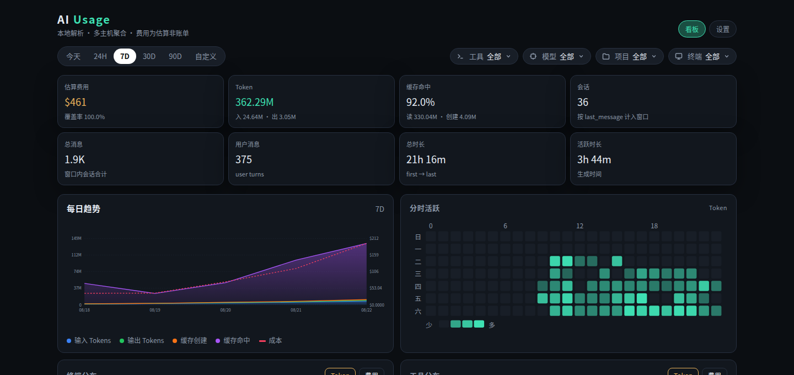

# AI Usage

采集端只读解析本机 AI 工具日志并增量上报；看板端接收多主机数据、落库、估算费用并内嵌 Web UI。两端为独立静态二进制，耦合是 ingest 协议与 agent 主动拉取的 join 接入。

[](https://github.com/Huanfiy/ai-usage/actions/workflows/ci.yml)
[](https://github.com/Huanfiy/ai-usage/releases/latest)
[](LICENSE)



## 它做什么

- **只读采集**：解析本机日志，不上报 prompt、补全或源码
- **两套二进制**：`ai-usage-agent` 采集，`ai-usage-dash` 看板，可分开部署
- **多机聚合**：看板一台，各宿主机 agent 向外推送
- **费用是估算**：查询时叠加价目快照，不是账单

## 快速体验

从 [Releases](https://github.com/Huanfiy/ai-usage/releases/latest) 取 Linux x86_64 包（见下方安装），解压后：

```bash
./ai-usage-dash serve
./ai-usage-agent init --url http://127.0.0.1:3847
# 打印确认码；浏览器打开看板设置页批准
./ai-usage-agent daemon
```

浏览器打开 http://127.0.0.1:3847 。采集端本机面板在 http://127.0.0.1:3848 。

从源码开发用 `./run.sh run` 起看板，再 `./run.sh agent init …`。已装 user service 时用 `./run.sh agent reload`，不要再开一条前台 daemon。全部命令见 `./run.sh help`。

## 安装（Linux x86_64）

当前发布只提供 **Linux x86_64 musl 静态二进制**，不依赖宿主机 glibc / Node / Python。其它平台尚未提供。

```bash
VER=0.3.0
BASE=https://github.com/Huanfiy/ai-usage/releases/download/v${VER}
curl -fLO "${BASE}/ai-usage-${VER}-x86_64-unknown-linux-musl.tar.gz"
curl -fLO "${BASE}/SHA256SUMS"
sha256sum -c SHA256SUMS --ignore-missing
tar -xzf "ai-usage-${VER}-x86_64-unknown-linux-musl.tar.gz"
install -m755 "ai-usage-${VER}-x86_64-unknown-linux-musl"/ai-usage-{agent,dash} ~/.local/bin/
```

包内 `deploy/` 有可选 systemd 单元；`ai-usage-agent daemon install` 会把二进制统一装到 `~/.local/bin` 并注册 user service。user service 跟随登录会话：无图形会话的服务器需 `loginctl enable-linger $USER`，否则开机不启动、登出即停止。Agent **不容器化**（必须读宿主机 `$HOME`）。看板可选 [deploy/Dockerfile.dash](deploy/Dockerfile.dash)。

## 说明

**采集源**：Claude Code、Codex、Grok、Cursor。Cursor 按账号幂等，不按机器累加。计入边界见 [docs/design/parser-boundaries.md](docs/design/parser-boundaries.md)。

**自身文件**：只走 XDG（`~/.config/ai-usage`、`~/.local/share/ai-usage`），可用 `--config` / `--data-dir` 改。不写 `~/.claude`、`~/.codex` 等工具目录。

**看板暴露**：默认绑回环 `127.0.0.1:3847`。绑非回环须设 `ui_token`，或加 `--behind-proxy`。

**费用**：查询时用构建期嵌入的 LiteLLM 价目快照（MIT）；设置页「更新价目表」按钮或 `ai-usage-dash pricing update` 可刷新数据目录缓存，前者刷完即热替换、不必重启。未知模型计入 token、排除出费用，并以 coverage 给出覆盖比例。细节见 [docs/design/architecture.md](docs/design/architecture.md)。

**多机**：看板部署到一台机器，各宿主机 agent 向外推送。同一采集端可同时向多个看板地址上报。

**开发**：本机入口 `./run.sh`。架构与约束见 [docs/design/architecture.md](docs/design/architecture.md)。

## 现状与后续

- [x] Linux x86_64 musl 发布
- [x] Claude Code / Codex / Grok / Cursor
- [ ] macOS / Windows / aarch64 发布
- [ ] 贡献指南与 Issue 模板
- [ ] SECURITY.md
- [ ] 英文 README
- [ ] crates.io

## 许可

[Apache License 2.0](LICENSE)。允许使用、修改与再分发；二次开发须保留版权声明与 `NOTICE`，并写明源自本项目。
