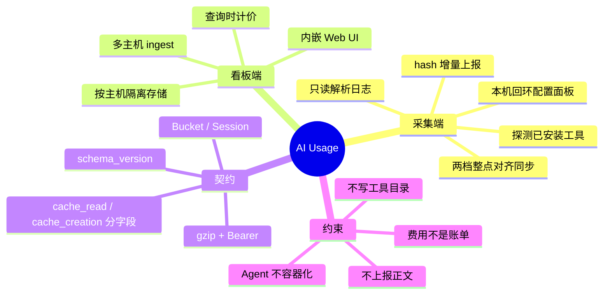
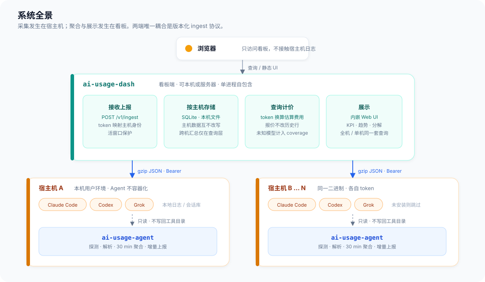
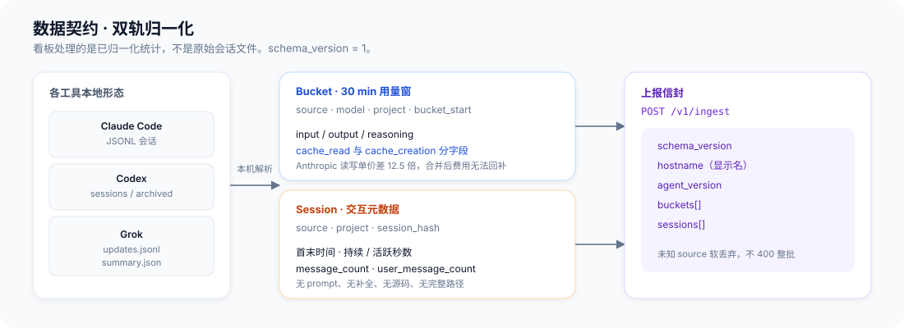
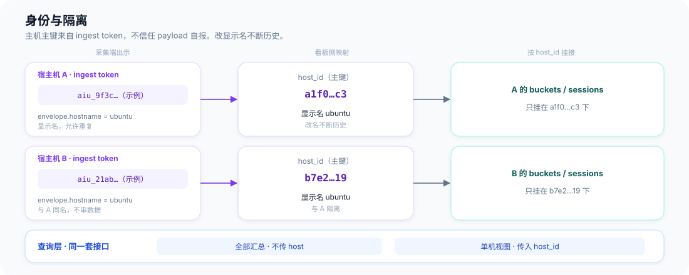
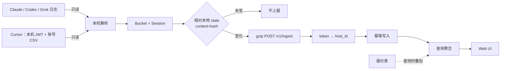
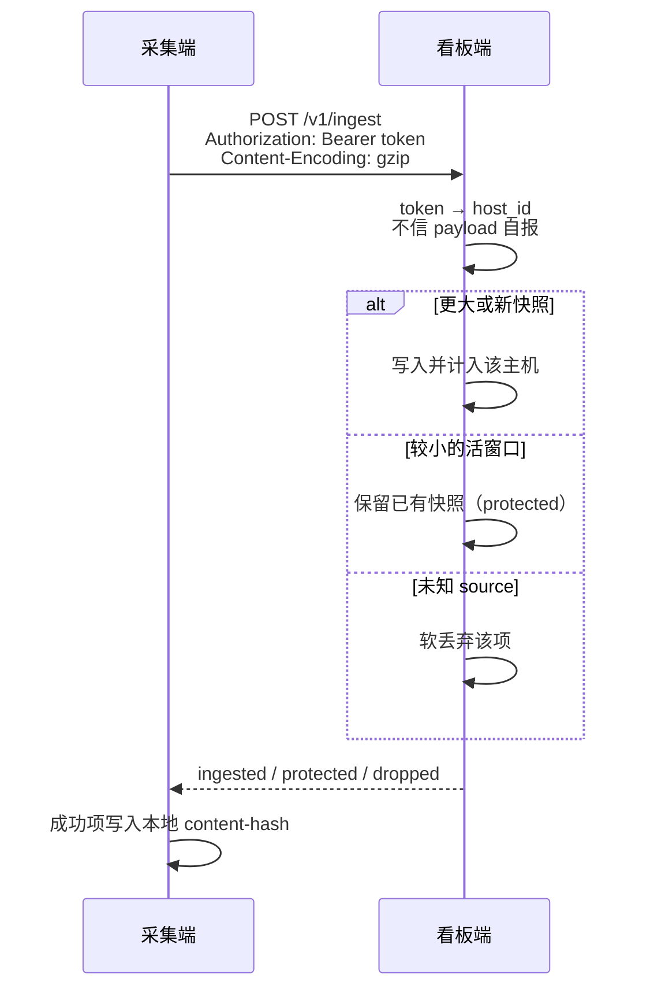
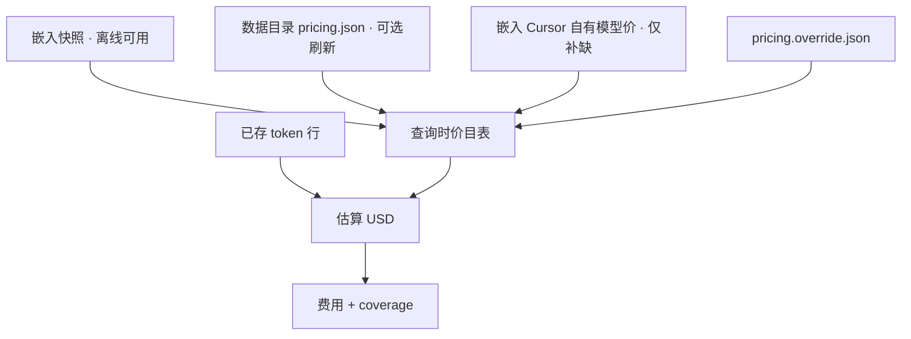
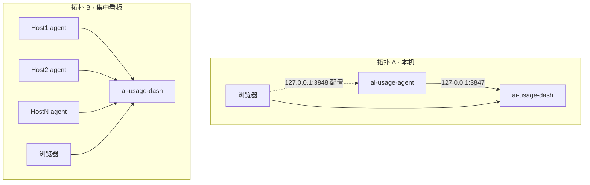
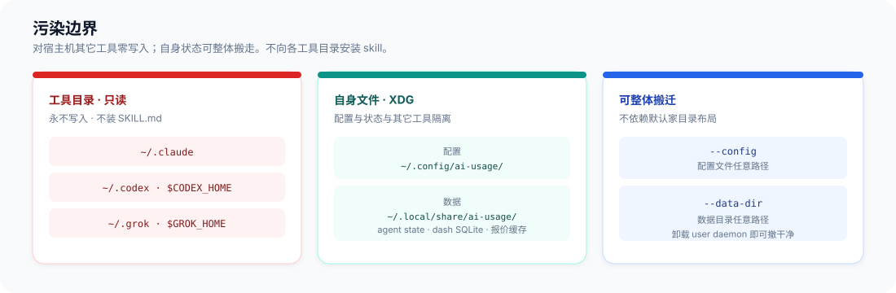

# AI Usage 系统架构

用量可见性系统：各宿主机上的采集端只读解析本机 AI 工具日志，归一化为统计后增量上报；独立部署的看板端接收多主机数据，落库、在查询时估算费用，并提供 Web 看板。两端为可独立发布的静态二进制，唯一耦合是版本化 ingest 协议（`schema_version = 1`）。

定位是**可见性，不是结算凭证**。上报不含 prompt、补全、源码。

| 本文覆盖 | 本文不覆盖 |
| --- | --- |
| 双程序职责、部署拓扑、多主机身份 | crate / 模块拆分、表结构、CLI 细节 |
| 归一化数据契约与端到端数据流 | 解析器内部算法、UI 组件结构 |
| 费用估算在查询层的叠加方式 | 运维手册与发布流水线 |
| 宿主机污染边界与信任模型 | 未落地的采集源 |

需求中的「后端 / 前端」对应采集端 `ai-usage-agent` 与看板端 `ai-usage-dash`。

## 概念地图

## 系统全景

同一套二进制支持两种拓扑：本机看板只绑回环；集中看板放一台机器，各宿主机 agent 向外推送。Agent 必须读宿主机 `$HOME`，**不容器化**。看板可选容器，数据目录挂卷。

| 程序 | 负责 | 不负责 |
| --- | --- | --- |
| `ai-usage-agent` | 发现已安装工具、只读解析、本地聚合成 Bucket / Session、增量上报、可选 user-level daemon 与本机配置面板 | 写入其它工具目录；上报 prompt / 代码；看板查询；估算费用 |
| `ai-usage-dash` | 鉴权接收、按主机落库、查询聚合、费用估算、内嵌静态 UI | 扫描宿主机 AI 日志；依赖 Postgres / Redis；运行时访问价目网站 |

默认看板地址 `127.0.0.1:3847`。绑定非回环地址时须设置 `ui_token`，或声明前面已有反向代理（`--behind-proxy`）。ingest 始终按主机一把 Bearer token；本机回环默认不强制 UI 登录。采集端 daemon 另开本机面板（默认 `127.0.0.1:3848`），只绑回环，用来看/改本机配置、挂 Cursor 额外凭证；dash 不向 agent 下发配置。两档上报间隔按 Unix 钟面刻度对齐（5m → `:00/:05`，30m → `:00/:30`），不是上次同步后再等一段；启动后立刻同步一次。

## 数据契约

采集发生在宿主机。看板只接收**已归一化的统计**，不接收原始会话文件。

两条轨道用途不同：

- **Bucket**（30 min 窗）：费用与趋势的计量单元。维度为 `source × model × project × bucket_start`。`cache_read` 与 `cache_creation` 必须分字段——Anthropic `cache_creation` 约基价 1.25×、`cache_read` 约 0.1×，单价差 12.5 倍，合并入库后费用无法回补。无 `cache_creation` 概念的源（如 Codex）该字段为 0。
- **Session**：活跃度与明细列表。时间、条数与 token 分项（与 Bucket 五项同口径），没有正文。`project` 仅为目录名；采集端可关闭上传，看板也可强制显示为 `unknown`。Cursor 无 session。Codex fork / sub-agent 仍出条目，token 为 0。

幂等按主机隔离（`host_id` 由服务端 token 映射，不取自 payload）：

- Bucket：`host_id | source | model | project | bucket_start`
- Session：`host_id | source | session_hash`

同一 session 文件被同步到多台机器时，各自计入所在主机，不做跨机去重。未知 `source` 软丢弃，不因单项未知而拒绝整批。正在增长的 30 min 桶遵循**活窗口保护**：库中已有更大 token 快照时，较小上报不覆盖。

## 身份与多主机

主机身份以 ingest token 派生的 `host_id` 为准。payload 里的 `hostname` 只作显示名，允许重复、允许改名。采集端同时上报本机 UTC 偏移（如 `+08:00`），供会话墙钟展示；账号行不带时区。两台都叫 `ubuntu` 的机器不会串数据。跨主机「汇总」只发生在查询层；删除或吊销某一主机不改写其它主机的行。

账号级源（目前仅 Cursor）例外：ingest 用校验过的 `account_hash` 把桶写到 `acct:<hash>`，同一登录在多机上报时落同一行，全机 `SUM` 只计一次。吊销或删除某台机器不删除该账号行。

查询接口同一套：不传 `host` 为全主机汇总，传入则为单机视图。看板提供 KPI（含窗口内消息与时长合计）、时间范围、工具 / 模型 / 项目 / 主机筛选、趋势、四维分布、分时热力图（Bucket 小时格）、session 列表、主机上次同步，以及 token 签发、吊销与删除。已吊销的主机可删除：清掉该机 token、主机行与其用量，其它主机与 `acct:` 行不动。

## 端到端数据流

安静机器上，content-hash 与本地 state 一致则不上报（0 字节）。成功批次才把 hash 写入 agent state。本地日志被删除时，只修剪 agent state，**不自动删看板历史**，避免解析短暂失败被当成「全量重传」。

## 费用估算

采集端**不上报费用**。历史 token 行不因改价而重写。未知模型计入 token、排除出费用，并以 coverage 给出覆盖比例。这是估算，不是账单。

权威默认源为 LiteLLM 价目表（MIT）：构建期裁成精简快照并嵌入看板，`serve` 不依赖网络。可选 `ai-usage-dash pricing update` 从 `https://raw.githubusercontent.com/BerriAI/litellm/main/model_prices_and_context_window.json` 刷新数据目录缓存。LiteLLM 没有的 Cursor 自有模型（Composer 2.5、Cursor Grok 4.5/4.6 及 Fast 档）用构建期嵌入的官方列表价补缺（`crates/dash/pricing/cursor-models.json`），不随 `pricing update` 刷新，随本仓库版本更新。再可选本地 override，后者覆盖前者。不做运行时爬官方价目页，不依赖 OpenRouter。

模型 id 两条独立管道，入库都保留原始 slug。查询展示与筛选只走展示名：去掉 effort / thinking（`xhigh`/`high`/`medium`/`low`/`max`/`thinking`）、渠道前缀 `cursor-` 与快照后缀 `-build`，Fast 档单独成项。计价只看原始 slug：先去 `anthropic/`、`openai/` 等前缀；`composer-*` / `cursor-grok-*` 只去掉 effort 后再匹配 Fast 与标准档，避免前缀误把 Fast 算成标准价，也不走展示折叠。匹配失败记入 uncovered，不中断查询。

## 部署拓扑

- **拓扑 A**：看板绑回环，本机 agent 上报。空库首次 `serve` 会签发一把本机 ingest token（只显示一次）。`ai-usage-agent daemon` 提供本机配置面板。
- **拓扑 B**：看板一台、agent 多台。Agent 跑在用户会话里（可选 user systemd / launchd），不装 system 服务。各机自己的面板只在该机回环可开。看板可选 `deploy/Dockerfile.dash`（默认 `--bind 0.0.0.0:3847 --behind-proxy`），卷挂载数据目录。

## 污染边界与信任

对宿主机其它工具零写入；自身文件只走 XDG，或用 `--config` / `--data-dir` 整体搬迁。静态 musl 二进制不要求宿主机安装 Node / Python。不向各 AI 工具目录安装 skill。

| 通道 | 鉴权 |
| --- | --- |
| ingest | 每机一把 Bearer token，可吊销；吊销后该主机无法再报。已吊销的主机可删除其用量 |
| UI / 查询 | 回环默认开放；非回环须 `ui_token` 或反向代理 TLS |
| agent 面板 | 只绑回环；Cursor 额外 JWT 只存在该机数据目录，不上报看板 |

## 本阶段范围

已接入的采集源：Claude Code、Codex、Grok、Cursor。各源扫描根、计入与明确不计见 [parser-boundaries.md](parser-boundaries.md)。某一源失败不影响其它源。

明确不做：
- 排行榜、设备码浏览器登录、往各工具写 `SKILL.md`
- MITM / 网络拦截计量
- Postgres 集群、多租户 SaaS
- 把 agent 放进 Docker 当作默认安装方式
